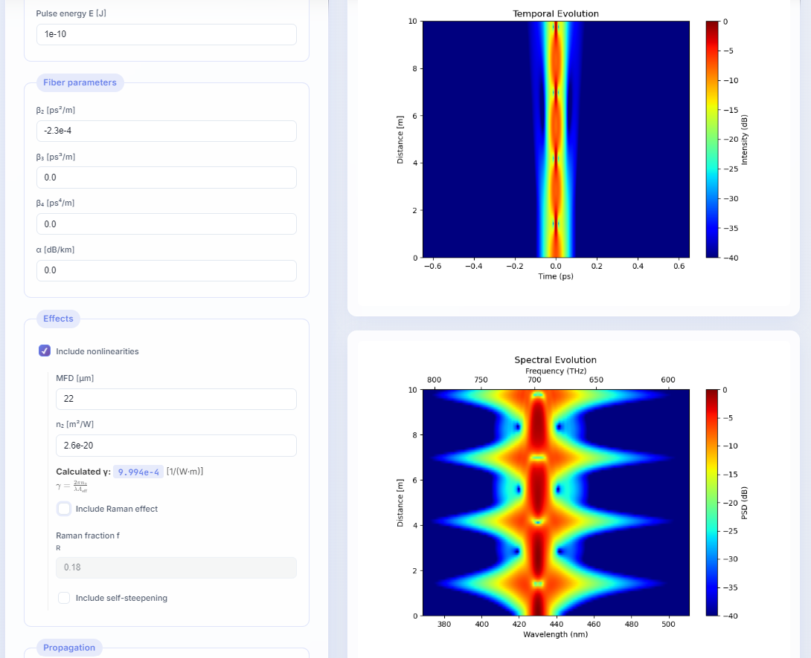

# NLSE Solver - Pulse Propagation Simulation


[](https://visuphy.org/NLSEsolver/)

A powerful, web-based tool for simulating optical pulse propagation in nonlinear fibers. This project solves the **Generalized Nonlinear Schrödinger Equation (GNLSE)** using the Split-Step Fourier Method (SSFM), allowing researchers and students to visualize complex nonlinear optical phenomena in real-time.



## ✨ Features

-   **High-Performance Simulation**: Efficiently solves the GNLSE including:
    -   Group Velocity Dispersion (GVD / $\beta_2$)
    -   Third-Order Dispersion (TOD / $\beta_3$)
    -   Fourth-Order Dispersion (FOD / $\beta_4$)
    -   Self-Phase Modulation (SPM / Nonlinearity)
    -   Stimulated Raman Scattering ($\tau_R$)
    -   Self-Steepening Effect
-   **Interactive Visualization**:
    -   **Time Domain**: Pulse shape evolution.
    -   **Spectral Domain**: Spectral broadening and shifting.
    -   **Spectrograms**: X-FROG / Gating traces for complete pulse characterization.
    -   **Evolution Heatmaps**: Visualize propagation dynamics along the fiber length.
-   **Modern UI**: Responsive, glassmorphism-inspired design built with vanilla CSS and JavaScript for maximum performance and compatibility.
-   **Real-time Validation**: Instant feedback on parameters like $N$, $\gamma$, and transform-limited pulse durations.

## 🚀 Installation

### Prerequisites
-   Python 3.8 or higher
-   `pip` (Python package installer)

### Setup
1.  **Clone the repository**:
    ```bash
    git clone https://github.com/visuphy/NLSEsolver.git
    cd NLSEsolver
    ```

3.  **Set up a Virtual Environment** (Recommended):
    ```bash
    python -m venv venv
    # Windows
    venv\Scripts\activate
    # macOS/Linux
    source venv/bin/activate
    ```

4.  **Install dependencies**:
    ```bash
    pip install -r requirements.txt
    ```

## 🛠 Usage

1.  **Start the Local Server**:
    To run the tool **without computational limits** (recommended for local use):
    ```bash
    python run_local.py
    ```
    *Note: This starts the server in development mode, allowing for higher grid resolution (N up to $2^{24}$).*

2.  **Open in your browser**:
    Navigate to [http://localhost:5000/NLSEsolver/](http://localhost:5000/NLSEsolver/).

3.  **Run a Simulation**:
    -   Adjust the **Grid** settings (Time window, $N$ points).
    -   Configure the **Input Pulse** (Shape, Wavelength $\lambda_0$, Duration, Energy).
    -   Set **Fiber Parameters** ($\beta$ coefficients, $\alpha$, Length).
    -   Toggle **Nonlinear Effects** (SPM, Raman, Steepening).
    -   Click **"Run simulation"** to see the results.

## 📂 Project Structure

-   `app.py`: Main Flask application server. Handles routing and simulation requests.
-   `solver.py`: Core physics engine containing the SSFM implementation and GNLSE logic.
-   `templates/`: HTML templates (`index.html` for the main tool).
-   `static/`: Static assets including `style.css` and JavaScript logic.
-   `requirements.txt`: List of Python dependencies.

## 🤝 Contributing

Contributions are welcome! Please feel free to submit a Pull Request.

## 📜 License

This project is open-source and available under the [MIT License](LICENSE).

## 👨‍💻 Authors

-   **Hussein-Tofaili**
-   **VisuPhy**
